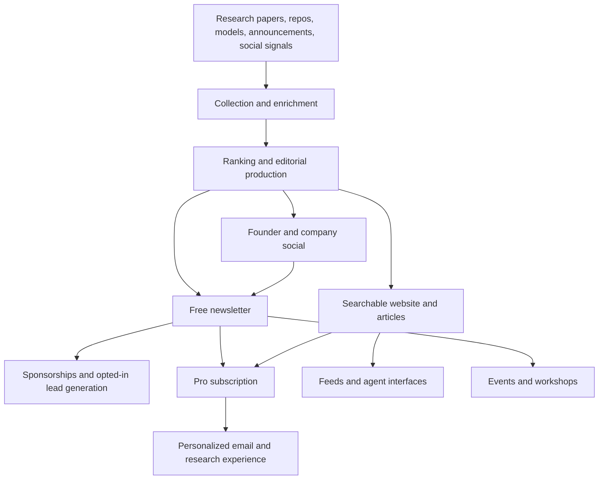

# AlphaSignal, reverse engineered

Research date: 26 September 2026. Public-source investigation of the AI newsletter at alphasignal.ai, its publishing system, distribution, products, team, and commercial model.

## What the evidence says

My assessment: AlphaSignal's strongest asset is a recurring relationship with people who build AI systems. It uses research selection and technical explanation to maintain that relationship, sells access to the audience through advertising, and is expanding into paid research and discovery tools. Reproducing the email layout would reproduce only a small part of the business.

The most informative evidence came from its actual email archives, public sponsorship deck, live pricing, employer-written engineering and growth jobs, and an operations vendor's customer story. Sources are linked beside claims throughout this report. Company audience figures, profitability statements, and product promises remain self-reports unless explicitly described as directly observed.

The newest full-stack engineering listing claims **320,000+ newsletter subscribers**. A separate product role says it publishes **six days a week** and describes the business as bootstrapped. These are more current descriptions than many newsletter directories, although neither is an audited subscriber ledger. [Full-stack role][fullstack], [product role][product].

The following is a reconstruction across sources. Arrows represent the apparent business process, not a recovered internal system diagram.

The collection/ranking side is disclosed in the backend role; advertising products are listed by BuySellAds; Pro is visible in the live pricing page; feeds and agent interfaces have public documentation. The commercial connections between them are analysis. [Backend role][backend], [advertising inventory][bsa], [pricing][pricing], [agent discovery][llms].

## 1. Company and evolution

The current publisher is **Alpha Signal, LLC**, identified in its terms as a Delaware company. The terms, effective 12 May 2026, cover free access, paid recurring subscriptions, advertising, affiliates, and referral programs. They describe monthly/annual renewal, cancellation at the end of the paid period, and a seven-day initial refund window. This establishes the stated commercial structure, not its financial results. [Terms][terms].

The official editorial page identifies **Lior Alexander as founder and CEO**. Older authenticated Beehiiv editions use **Lior Sinclair** as their byline. Retain the historical name when tracing those editions; use the current name for today's founder. A company LinkedIn profile gives 2020 as the founding year. An AlphaSignal-branded Substack About page describes a start in Yoshua Bengio's lab, but its relationship to the current footer's different Substack address is not resolved here. The lab-origin story should therefore remain attributed, not independently established. [Editorial team][standards], [historical archive][beehiiv], [company profile][company], [Substack About][substack].

The defensible chronology is:

| Period | Evidence | What it establishes |
|---|---|---|
| 2020 | Company profile | Claimed founding year |
| May–December 2023 | Authenticated Beehiiv editions | Distinct research, code, news and teaching formats; human contributor credits; algorithmic selection claims |
| Around 2024 | A writer's own announcement | Human writing team and a claimed 170K readership |
| Legacy deck, asset timestamp January 2025 | Official media-kit PDF | Four weekly emails, 200K+ audience claim, public ad rates |
| Early 2026 | Viktor customer story | Small team with substantial sales and operations automation |
| September 2026 | Live site, archive, pricing, employer listings | Pro, structured news product, broader team, agent distribution and subscription-growth ambitions |

The archive is authenticated by Beehiiv's own article linking to the historical AlphaSignal publication. Its present name is Lior's View; that rebranding does not erase the AlphaSignal editions it hosts. [Beehiiv's directory article][beehiiv-directory], [writer announcement][ghita].

No verified cap table, valuation, funding round, or ownership percentages were recovered. The employer's bootstrapped description is the strongest primary statement about financing found in this investigation.

## 2. Audience size and quality

Their public numbers use different dates and definitions. They should not be combined into a growth chart.

| Source | Reported number | Qualification |
|---|---:|---|
| Current full-stack hiring page | 320K+ subscribers | Company claim |
| Live About page | 300K+ subscribers | Company claim |
| LinkedIn company description | 270K readers | Profile copy may lag |
| BuySellAds | 250K active subscribers; 40% opens | Advertiser-facing claim; cohort and measurement method unstated |
| Early-2026 Viktor story | 280K+ subscribers; 38% opens | Vendor/customer account |
| Legacy media kit | 200K+ readers; 44% opens; 14% clicks | Historical; click denominator unspecified |

Sources: [full-stack role][fullstack], [About][about], [company profile][company], [BuySellAds][bsa], [Viktor][viktor], [deck, page 2][kit].

BuySellAds reports an audience concentrated in developers, data scientists, ML engineers and researchers: 23%, 19%, 15% and 10% respectively. The remaining 33% is unspecified. It reports 55% at employers with at least 1,000 staff, and regional shares of 35% North America, 35% Europe and 30% Asia. These are sales targeting claims without a published survey methodology. They suggest why developer infrastructure vendors buy placements, but do not prove purchase authority. [Advertiser audience profile][bsa].

Treat employer logos as claimed reader affiliations. They do not establish a formal relationship with those employers. Likewise, social followers, email subscribers, LinkedIn newsletter subscribers, impressions and monthly reach are different measures. The same person can appear in several.

The useful competitor benchmark is **retained, engaged technical readers**, followed by qualified sponsor actions and paid conversions. Raw list size cannot answer those questions.

## 3. What the newsletters actually contain

The live archive eventually loaded **602 total issues**. Its September 2026 view showed **22 issues through September 25**, with weekdays and Sundays represented and no Saturdays in that period. This is an observed archive snapshot, not proof that every subscriber received every edition. Initial text extraction showed only an empty shell; that was a coverage failure, not an empty archive. [Current archive][archive].

### The current weekday and Sunday products

Four actual September email renditions were inspected through their publicly embedded newsletter HTML. This is stronger evidence than inferring email structure from a news article.

| Date | Format and observed content | Approximate body words | Displayed read time |
|---|---|---:|---|
| [September 25][email25] | Three lead stories; two full sponsor modules; six short Signals, including one paid; webinar promotion | 1,092 | 6m59s |
| [September 24][email24] | Three lead stories; two full sponsor modules; six short Signals, including one paid; Lior author box | 1,025 | 6m39s |
| [September 20, Sunday][email20] | Ben Dickson technical article; six subheadings; researcher interview material; Google Cloud promotion near both ends | 1,218 | Not found |
| [September 13, Sunday][email13] | Ben Dickson technical explanation; seven subheadings and diagrams; Datadog promotion near both ends | 1,507 | Not found |

The weekday pattern is an introduction that connects the day's developments, a contents summary, three roughly 150–170-word explanations interleaved with advertisements, six compact Signals, and a commercial footer. This is a two-edition observation, not a guarantee about every weekday. Friday's partners include Prior Labs, Origin Technology and Sentry. The masthead repeats one sponsor, so placement count and distinct sponsor count differ. Signals attach source-native popularity measures such as stars, likes or downloads. [September 25][email25].

Thursday's main stories link to source material and offer per-story forwarding. Its `mailto:` controls prefill the subject, excerpt and archived issue link with forwarding attribution. Outbound links have campaign/link identifiers. The observed template uses 600-pixel tables, Helvetica/Arial, white cards, gray dividers, orange calls to action and a small-screen breakpoint. Its large sponsors are Wiz and Google Cloud, with a short pre.dev placement. [September 24][email24].

The Sunday product supplies deeper analysis under a named writer. September 20 includes quotations attributed to a researcher speaking to AlphaSignal, evidence that the publication presents original reporting. The interview itself was not independently verified. September 13 proceeds through a technical explanation toward model-selection implications. Its footer still uses both 200K and 250K audience figures, showing that even fresh editions can contain stale boilerplate. [September 20][email20], [September 13][email13].

The two weekday read-time labels exceed the landing page's five-minute promise. Current counts run from greeting to mission footer and include ads, author information and repeated contents headings; actual inbox personalization was not observed. No rating prompt appeared in these four public renditions. The historical feedback mechanism below should not be assumed to remain in every current edition.

### The older formats explain how it developed

For historical format analysis, eleven dated 2023 editions were inspected. Approximate body lengths had a median of **1,037 words**, a range of **684–1,606**, and a mean of about **1,037**. Seven displayed reading estimates between **3:03 and 5:31**. Counts include introduction, headings, code and sponsor copy, but exclude page chrome, final feedback and sales footer. Images contribute information outside the word count. This is a purposive sample of formats, not a random sample or a current average.

| Product | Typical observed construction | Reader's next action |
|---|---|---|
| Research digest | Three explained papers plus three short paper listings; author and artifact links | Read the paper or implementation |
| Code/repository digest | One substantial feature, five shorter repositories, sometimes model picks, Python/PyTorch tips | Try a repository or technique |
| News digest | About five short announcements, then two or three larger items | Understand and investigate a release |
| Breaking edition | One consequential launch, capability summary and interpretation | Assess whether the release matters now |
| Teaching edition | Sequential explanation, code, recap and next-installment link | Learn a reusable skill |
| Models/spaces edition | Lead feature plus a small selection of models and demos | Test a model or demo |

The historical paper editions turn an abstract into a repeatable explanation of the problem, new contribution, method and result. The May 6 issue publishes scores but does not explain their calculation. Its title says five papers while its body contains six, a small example of why the format and its quality control should be evaluated separately. [May research edition][paper-may], [December research edition][paper-dec].

Repository editions often give the lead item a command, technical explanation or image, then use short descriptions for the rest. Evergreen coding tips mean an edition can remain useful when the week's releases are less compelling. [May repository edition][repo-may], [October repository edition][repo-oct].

News can break the normal schedule. The December 6 Gemini edition focuses on one launch, while the December 11 issue combines announcements with larger coverage. The older archive shows Monday news, Wednesday implementation and Saturday research in two November weeks, with additional sends in December. A weekly section did not mean the entire publication sent only once weekly. [Breaking edition][gemini], [December news][mistral], [November archive][archive2].

The two October teaching editions explain embeddings and tokenization with code, specialist contributor attribution, references and a continuation hook. This creates a reason to return independent of breaking news. [Teaching part one][teach1], [teaching part two][teach2].

The sampled subject-style headlines commonly pair a recognizable model or company with a concrete capability, comparison or provocative question. Emojis are common in the historical sample. That is an observed writing pattern; no subject-line experiment results were recovered.

All eleven historical editions include a three-option reader-rating prompt. Several have two promotional modules. December 13 names Igor Tica as contributor and Jacob Marks as editor, direct evidence of human production alongside algorithmic-selection marketing. [December 13 edition][translate].

### Historical sample ledger

| Date | Edition | Approximate words |
|---|---|---:|
| 2023-05-03 | [AI repositories and coding tips][repo-may] | 825 |
| 2023-05-04 | [Hinton leaves Google][news-may] | 1,363 |
| 2023-05-06 | [Research digest][paper-may] | 1,173 |
| 2023-10-04 | [StreamingLLM and implementation roundup][repo-oct] | 1,037 |
| 2023-10-08 | [Understanding LLMs, first installment][teach1] | 1,207 |
| 2023-10-29 | [Understanding LLMs, second installment][teach2] | 1,606 |
| 2023-12-06 | [Gemini launch][gemini] | 684 |
| 2023-12-09 | [Chain of Code research digest][paper-dec] | 768 |
| 2023-12-11 | [Mixtral and news roundup][mistral] | 942 |
| 2023-12-13 | [SeamlessM4T and repositories][translate] | 1,108 |
| 2023-12-14 | [Optimus, models and spaces][tesla] | 697 |

The word counts measure web renditions of editions. Delivered emails may differ in personalization, rendering and footer content.

## 4. Website, editorial depth and accuracy

The current site has a ranked feed, time and topic filters, company pages, bookmarks, an editorial area and Pro labels. At inspection, the homepage showed a 24-hour filter and 16 results. Counts and visible items are a snapshot, not a measurement of long-term throughput. [Homepage][home].

The editorial product contains named-author tutorials and claimed original experiments. A September prompt-caching article uses front-loaded takeaways, code, cost figures and a continuation gate. An August model comparison describes private debugging tasks. Those are meaningful differentiators from a link roundup, but their experiments were not reproduced in this research. [Prompt-caching tutorial][caching], [debugging comparison][debugging].

A small accuracy spot check compared the September 17 Anthropic R&D article with the linked original publication. Major figures and important qualifications matched, including the distinction between monitored blocks and actual incidents. That is one positive check, not a publication-wide accuracy score. [AlphaSignal story][rd-story], [original Anthropic source][rd-original].

There are also presentation inconsistencies: an older archive edition exposes an unresolved first-name template expression, and a current Shieldstral page has differing author attribution between the editorial listing and article field. These observations justify verification; they do not establish a general error rate. [Historical example][news-may], [Shieldstral page][shieldstral].

## 5. The unresolved automation claim

The About page claims real-time learned ranking, autonomous coverage with **"no human in the editorial loop"**, and an eventual connected AI knowledge graph/R&D copilot. Its priority and market-leadership claims were not independently established. [About][about].

The editorial standards page assigns final decisions and corrections to **Ben Dickson**, names three writers, and says a proofreader reviews claims before publication. It promises primary-source sourcing, labels for paid content, and dated notes for substantive corrections. [Newsroom standards][standards].

A current Head of Content role explicitly includes managing technical writers and **two social media managers**, while developing paid educational and analytical formats. [Content leadership role][content].

Public evidence therefore supports substantial automation **and** human editorial work. It does not resolve whether particular news streams are fully automated, what proportion gets reviewed, or whether the pages describe different moments in a transition. Both blanket conclusions, all AI-written or all human-verified, would exceed the evidence.

For a competing publisher, the useful question is who verifies a claim, who owns a correction, and whether readers can inspect the original evidence. The advertised level of autonomy does not answer those questions.

## 6. How they make money

Current BuySellAds inventory includes three regular email placements, a collaborative technical deep dive, and founder posts on X/LinkedIn. Current rates require a quote. The newsletter is therefore packaged as several products for advertisers, including technical education and social distribution. [Current sales inventory][bsa].

The legacy deck's URL timestamp suggests a **3 January 2025** upload. These historical prices are **not current quotes**. [Official deck][kit].

| Placement | Historical USD price | Copy limit | Claimed clicks | PDF page |
|---|---:|---:|---:|---:|
| Main | $6,000 | 150 words | 1,000–5,000 | 8 |
| Secondary | $3,000 | 50 words | 500–1,500 | 9 |
| Signal line | $1,500 | 15 words | 300–1,000 | 10 |
| Dedicated email | $10,000 | 1,200 words | 1,000–3,000 | 11 |
| LinkedIn post | $2,500–5,000 | 200 words | 500–5,000 | 12 |

The deck specifies one of each regular slot and four weekly emails. Click definitions and independent verification are absent.

Additional revenue mechanisms are explicitly disclosed: affiliate commissions and sponsor lead/referral programs with a separate opt-in before personal information goes to the sponsor. Sponsors can receive aggregate or de-identified engagement reporting. Volumes, actual lead prices and contribution margins are unknown. [Privacy disclosure][privacy].

### What can be calculated

Historical inventory capacity, assuming every slot sold at list price:

`($6,000 + $3,000 + $1,500) × 4 sends/week × 52 weeks = $2,184,000`

This is mathematical gross capacity, not estimated revenue. Unsold inventory, discounts, commissions and costs are unknown. It excludes dedicated sends, social and subscriptions.

An executive hiring post says the company is profitable and was on track to quadruple 2026 revenue over 2025. No absolute revenue or audited financial results accompany that statement. A forecast made during the year is not a completed-year result. [Executive statement][profit].

## 7. Pro and Team subscriptions

The following prices and offers were read from the live pricing UI on the research date. Checkout and delivery were not tested. [Pricing][pricing].

| Offer | Observed price | Main advertised value |
|---|---|---|
| Free | $0 | General ad-supported newsletter and broad announcement coverage |
| Pro monthly | $25/month | Personalized ad-free email, news/repos/papers/models, 25+ subtopics |
| Pro annual | $20/month equivalent, $240/year | Annual savings; credits/perks promoted with the annual option |
| Team | Contact sales, per seat | Longer archive, SSO/SAML, integrations/API, account support and SLA |

Pro also advertises analysis and events/workshops. Two details need clarification before buying: the card and comparison table differ on editorial exclusivity; Team says it includes Pro but its newsletter table cell is a dash. Advertised coverage percentages have no disclosed calculation.

For scale, 1,000 annual subscribers at the displayed price would represent $240K in annual gross subscriptions; 10,000 would represent $2.4M before tax treatment, discounts, churn, fees and costs. These are arithmetic scenarios. The number of paying subscribers was not found.

The product-manager brief describes connected discovery, alerts, source-backed AI answers and a knowledge graph. Its references to Bloomberg, Hugging Face, Product Hunt and Perplexity describe the intended product, not feature parity or proof that every workflow is already available. [Product role][product].

## 8. Acquisition and distribution

### Founder and company social

A founder's paid LinkedIn post demonstrates the structure directly: concrete engineering problem, before/after explanation, product capabilities, a partner label, and a tracked link in the comments. That is observable commercial creative, not proof of the anecdote or campaign performance. [Example sponsor post][ghost].

Other founder posts end with a newsletter subscription call to action. The personal account therefore supplies both subscriber acquisition and separately saleable advertising. AlphaSignal also maintains a LinkedIn-native newsletter. Its descriptive audience claim should not be mistaken for the count of subscribers on that platform. [Founder CTA example][social-cta], [LinkedIn newsletter][linkedin-newsletter].

The marketing lead has publicly acknowledged experimenting with an unusually bright HDR logo in LinkedIn feeds. It is evidence of deliberate attention experiments; no measured conversion lift was supplied. [Marketing experiment][hdr].

### Paid acquisition and partnerships

An older paid-growth job described buying readers through Meta, X, LinkedIn, TikTok, other newsletters, podcasts, YouTube creators and embedded CPL offers in complementary signup flows. It allowed flat-fee, lead-based and revenue-share creator deals. Its stated tests focused on retention, downstream paid conversion and acquisition cost. That is evidence of a growth plan; it does not prove each channel was running profitably. [Paid-growth role][paid-growth].

The newer growth brief changes the near-term target to **one million monthly website visitors and 10,000 paid subscribers**. It includes search, SEO, AI search, creators, affiliates and referral channels, with cohort retention and payback measurement. The older ambition of one million free email subscribers is a different goal. Neither target should be reported as attained. [Current growth role][growth].

### Conversion flow

The newsletter landing page offers email signup and Google/GitHub alternatives around a five-minute morning-reading promise. The main site also has account signup with email/password and a visibly selected newsletter opt-in control. No information was entered. Its signup journey beyond the first screen was inspected only through the public client code, not completed. [Newsletter landing page][landing], [main site][home].

The served newsletter asset defines a longer sequence including topics and a newsletters step, compared with ordinary account signup. The meaning of the newsletters step is unverified; it is insufficient evidence for a recommendation marketplace. The response also assigns a newsletter landing-page experiment flag. [Public landing-page asset][landing-asset].

Most notably, the page's weekly activity counters and scrolling example stories are literal values in that asset. They must not be used as actual ingestion volumes or fresh news. The signup page is a marketing demonstration, whereas the dated archive is evidence of published editions.

### Events and practical education

Brave documents an AlphaSignal hackathon in San Francisco on **6 August 2026**: more than 700 registrations, more than 100 participants, a 90-minute pizza-agent challenge and a $2,500 prize pool. Brave's own recap connects the event to developers using its API. That establishes a real event channel and partner activation, but not the sponsorship fee or attendee-to-subscriber conversion. [Brave recap][brave].

A July 28 event listing promotes an AlphaSignal technical session on evaluating an LLM's web-search infrastructure. Developer-relations hiring similarly points toward notebooks, repositories, workshops and a future mobile/education offering. The job's future tense matters. [Web-search event][event], [DevRel role][devrel].

The Alpha-Signal GitHub organization has public Python and PyTorch tip repositories, including notebook examples. These support the history of practical learning material; they do not expose the proprietary newsletter backend. The Hugging Face organization likewise describes paper/repository discovery but carries an older 25K weekly readership claim, unsuitable as a current size estimate. [Python tips][python-tips], [PyTorch tips][pytorch-tips], [Hugging Face profile][hf].

## 9. Team and business operations

In a post explicitly referring to September 3, GM Kevin Curry reported ten hires plus contractors and profitability. The roles span brand partnerships, account management, growth, product, engineering, operations, technical writing and events. Names include John Apolinar, Meredith Brown, Dylan Schneider and Jana Marinovic on the commercial side; Alex Medick on events/brand; and engineering and growth hires. Contractor roles include writing and a fractional CTO. This is an executive account, not a payroll audit. [Team announcement][team].

A Viktor customer story gives an unusually concrete operating picture. It names **Slack, Sponsy, Agree.com, Notion, Gmail and Google Sheets**, and reports 18 automated workflows in 67 days after a February 19, 2026 installation. Examples include proposals, commission tracking, advertiser research, deal synchronization, meeting briefs, creator contracts and CPL landing pages. It reports 16 proposals ranging from $10K to $100K. Proposal values do not establish closed revenue. This is a vendor case study quoting company personnel, so its efficiency and financial implications are not independently audited. [Viktor case study][viktor].

The employer job board advertised engineering, content, growth and product positions, generally in the $125K–$165K annual salary range. Listings can remain visible after a hire. These figures show intended investment, not an actual payroll total. [Company job board][jobs].

The organizational lesson is concrete: publishing, advertising sales, audience acquisition, subscription product management and operations are distinct responsibilities. AlphaSignal's public materials give little support to treating the current business as one unattended newsletter script.

## 10. Reconstructed technical system

### Explicit employer disclosures

The backend job describes scrapers, LLM enrichment/editorial processing, MongoDB, ranking and foundations for a knowledge graph. It lists Python 3.11+, Firecrawl, BeautifulSoup, cron services, AWS, Sentry and familiarity with arXiv, GitHub, Hugging Face and X. It names Claude, GPT and Gemini APIs. It also lists several vector-database alternatives; that does **not** establish that every named database is deployed. [Backend role][backend].

The full-stack job is even more specific. It describes Next.js, an Express REST API, two MongoDB Atlas databases and containerized AWS services. Its published stack includes TypeScript, Node 24, Next.js 15.5, React 19.2, Tailwind 4, NextAuth v4, Express 4, the native MongoDB driver, JWT/bcrypt, node-cron, Pino, Docker, ECS Fargate, ECR, ALB, Secrets Manager, CloudWatch, S3, SES, GitHub Actions, CloudFormation, Stripe and PostHog. These are employer disclosures, not independently verified installed versions. [Full-stack role][fullstack].

### What public inspection corroborates

| Layer | Public evidence | Limit |
|---|---|---|
| Frontend | Next.js headers, RSC responses and static chunks | Exact version comes from hiring copy |
| Edge | Cloudflare response headers | Does not reveal complete origin topology |
| Main site and newsletter | Shared core assets and newsletter route rewrite | Strong evidence of shared frontend code |
| Analytics experiments | Experiment bootstrap cookie; PostHog now also named in job | No experiment results accessed |
| Email | Policy explicitly names SES plus an internal platform | No inbox placement or sending logs inspected |
| Inbound mail | Public MX records point to Google | Inbound routing differs from newsletter sending |
| Payment integration | Stripe in disclosed stack and allowed frontend origins | Checkout not tested |

Observed at [main site][home] and [newsletter site][landing]; email disclosure in [privacy][privacy]; deployment technologies in [full-stack role][fullstack]. Content-security allowlists alone only show what may load, not what actually runs.

### What remains proprietary

No ranking weights, training dataset, model checkpoints, prompts, source polling intervals, queue topology, evaluation results or per-story compute costs were recovered. The public claim of learned ranking over millions of inputs does not reveal how useful or reliable the ranker is. Reconstructing this system should start with measurable selection quality, not assumed complexity.

## 11. Agent, feed and search distribution

AlphaSignal has deliberately made its content discoverable outside the browser. Its public discovery index links RSS/Atom, Markdown article variants, topic/company/author material, sitemaps and LLM-readable indexes. These are content distribution interfaces, not complete inbox archives. [llms.txt][llms], [RSS][rss], [sitemap][sitemap].

Its MCP server card identifies `ai.alphasignal/news`, version 1.0.0, using Streamable HTTP at `https://api.alphasignal.ai/mcp`. The published skill documents anonymous discovery plus OAuth for personalized and full-content reads. It lists news, search, articles, personalized feeds, bookmarks/follows and company/author activity. The MCP transport and authenticated tools were not exercised. [Server card][mcp], [published skill][skill].

The live page also registered three browser WebMCP tools: latest news, search and navigation. Registration was observed; it does not prove every operation works. The advertised OpenAPI document contains health and RSS/Atom routes, not the entire application API. [OpenAPI][openapi], [API catalog][api-catalog].

My inference is that AlphaSignal wants the ranked corpus to become a source for researchers and agents wherever they work. The newsletter builds habit and reach; structured access makes the same collection reusable in other workflows. The commercial impact of that agent channel is unknown.

## 12. Important traps in a competitor analysis

| Tempting conclusion | What the evidence supports |
|---|---|
| It has exactly 320K engaged people | A current employer claim; active and total populations differ |
| It currently charges $6K for the main slot | A historical public card; current pricing is quote-based |
| 14% click rate means 14% of deliveries | The denominator and uniqueness are unspecified |
| It is entirely autonomous | Automation claims coexist with human staff, policies and hiring |
| Every headline is an email | News, editorial articles, feeds and dated email issues are separate objects |
| Empty extracted archive means no public archive | The live UI loaded 602 issues after hydration |
| Landing-page counters measure collection volume | They are hardcoded in the served asset |
| Every advertised Pro feature is operational | Pricing and hiring copy include promises not acceptance-tested here |
| It already has 10K paid subscribers | That is an employer's target |
| A proposal for $100K means a $100K sale | Proposals, bookings, collections and recognized revenue differ |
| Its footer links are finished AI integrations | Generic ChatGPT/Claude homepage links are not integration proof; public MCP documentation is separate |

The legacy Squarespace page is still accessible and uses older subscriber copy. Its latest-email link returned 404. The current footer points to `alphasignal.substack.com`, while search prominently returns `alphasignalai.substack.com`. The older Beehiiv site is now branded Lior's View. All three can mislead a superficial tool/provider audit. [Legacy site][legacy], [current footer][home], [historical archive][beehiiv].

## 13. What is worth adapting for Forward Pass

These are recommendations drawn from the research, not a review of Forward Pass's current implementation.

1. **Specify the engineering decision each item supports.** A useful brief answers what changed, who can use it, what it costs, what is actually available, and where the evidence stops. A summary without an action or decision is easy to replace.
2. **Use a small set of repeatable formats.** Research assessment, working repository, release analysis and practical tutorial require different evidence. Templates make quality easier to enforce and the reader's time easier to budget.
3. **Keep one source record behind all outputs.** Store original URLs, publication dates, access/license details, measured results and caveats once. Generate email, web and social from that record, with links back to the original evidence.
4. **Make the human contribution explicit.** A short tested example, comparison or qualified judgment can justify attention better than another generic roundup. State what was tested and retain the results.
5. **Measure retained readership by acquisition source.** Track delivery, meaningful clicks, replies/ratings, repeat activity, unsubscribes and eventual paid conversion. A cheap signup that never returns is not the same asset as a working engineer who reads weekly.
6. **Sell defined sponsor products.** Describe placement, copy constraints, audience evidence, expected reporting and disclosure. Keep editorial selection independent. AlphaSignal's historical prices are not a starting price list for a smaller publication.
7. **Tie paid value to saved work.** Useful filtering, alerts, comparisons, saved research and decision history are testable reasons to subscribe. Validate demand before building a broad knowledge-graph product.
8. **Expose source-backed content to agents when there is demand.** Stable canonical links, feeds and Markdown are a modest starting point. OAuth and a large tool catalog should follow real personalized-use cases.

A focused four-week experiment would be more informative than a full competitor clone. Pick one technical audience, publish twelve consistent editions with a tested lead item, turn each into one original social post, and measure source coverage, production time, useful clicks/replies and week-four return behavior. Compare with the publication's own baseline. Record which items readers say changed a decision. These are proposed acceptance criteria to define before the experiment, not AlphaSignal benchmarks.

## 14. What public research cannot settle

No verified actual revenue, profit margin, paid subscriber count, subscriber-level activity, CAC, lifetime value, paid-channel spend, sponsor renewal rate, discount schedule, conversion cohorts, deliverability or inbox placement was recovered. The private ranker, prompts, editorial approval history and actual automation percentage remain unknown.

No signup was submitted, no account created, no one contacted, and no purchase made. Consequently the welcome sequence, double opt-in, preference onboarding, personalized email differences, billing and cancellation behavior were not end-to-end tested. Authenticated content and a subscriber's actual inbox would be needed to resolve those gaps.

Research used ordinary public pages, public client assets, published feeds/docs, hiring materials, social posts and safe read-only browser inspection. There was no attempt to bypass authentication or retrieve private systems. Search indexes sometimes lagged, and some dynamic pages worked in the browser or ordinary HTTP retrieval while the web extractor failed. The report distinguishes those limits from missing product features.

## Source links

The links throughout this report point to the evidence for each claim. The highest-value starting points are the [current archive][archive], [historical archive][beehiiv], [media kit][kit], [pricing][pricing], [engineering job][fullstack], [backend job][backend], [growth brief][growth], [editorial standards][standards] and [Viktor operating case study][viktor].

[home]: https://alphasignal.ai/
[about]: https://alphasignal.ai/about
[archive]: https://alphasignal.ai/archive
[email25]: https://alphasignal.ai/email/e53c1b581ec9b101
[email24]: https://alphasignal.ai/email/328b8c3f25ea2a39
[email20]: https://alphasignal.ai/email/8f2be5a907777e51
[email13]: https://alphasignal.ai/email/dbce367ad97e73c6
[landing]: https://newsletter.alphasignal.ai/
[landing-asset]: https://newsletter.alphasignal.ai/_next/static/chunks/app/(newsletter)/newsletter/page-600d6b0549f63ad9.js
[pricing]: https://alphasignal.ai/pricing
[privacy]: https://alphasignal.ai/privacy
[terms]: https://alphasignal.ai/terms
[standards]: https://alphasignal.ai/editorial-team
[company]: https://www.linkedin.com/company/alphasignal/
[substack]: https://alphasignalai.substack.com/about
[beehiiv]: https://alphasignalai.beehiiv.com/
[archive2]: https://alphasignalai.beehiiv.com/archive?page=2
[beehiiv-directory]: https://www.beehiiv.com/blog/10-beehiiv-ai-news-newsletters-that-should-be-on-your-radar-for-2024
[ghita]: https://www.linkedin.com/posts/ghita-houir-alami_alphasignal-the-most-read-technical-newsletter-activity-7168303691320479745-Q2bE
[legacy]: https://signal-alpha.squarespace.com/
[bsa]: https://www.buysellads.com/discover/alphasignal-ai
[kit]: https://static1.squarespace.com/static/5ec0283961328f4785739290/t/677832243224683a884a7e66/1735930424898/media-kit.pdf
[viktor]: https://viktor.com/case-study/alpha-signal
[profit]: https://www.linkedin.com/posts/kcurry2_alpha-signal-llc-activity-7447285836620140545-0Yis
[team]: https://www.linkedin.com/posts/kcurry2_in-january-we-had-zero-employees-at-alphasignal-activity-7501263004534067200-9Bib
[fullstack]: https://jobs.gusto.com/postings/alpha-signal-llc-full-stack-engineer-28c7a0ed-f4eb-4696-92ef-2e3703696189
[backend]: https://jobs.gusto.com/postings/alpha-signal-llc-backend-engineer-f9f9da28-334f-4637-8c80-5d2504577663
[product]: https://jobs.gusto.com/postings/alpha-signal-llc-product-manager-1c7acf3e-5c3a-4bad-a3d7-90cbe0ec46f6
[paid-growth]: https://jobs.gusto.com/postings/alpha-signal-llc-head-of-paid-growth-797eed6e-b340-43eb-a664-80dc7dfcc24c
[growth]: https://jobs.gusto.com/postings/alpha-signal-llc-head-of-growth-c1e79a11-ec5a-4ba2-8c3c-2797dc296628
[content]: https://jobs.gusto.com/postings/alpha-signal-llc-head-of-content-5e74ae34-4fd2-4e68-91de-22d89f62c581
[devrel]: https://jobs.gusto.com/postings/alpha-signal-llc-head-of-developer-relations-5cc39d03-e492-487b-a2fa-e28cf1ab63d7
[jobs]: https://jobs.gusto.com/boards/alpha-signal-llc-08e8af23-b56d-47dd-a11e-1e059bf73998
[ghost]: https://www.linkedin.com/posts/lioralex_i-dont-trust-ai-agents-with-shared-database-activity-7470107516153036803-VJlN
[social-cta]: https://www.linkedin.com/posts/lioralex_someone-built-an-ai-powered-global-intelligence-activity-7432077085222846464-Tfo6
[linkedin-newsletter]: https://www.linkedin.com/newsletters/alphasignal-7077778910851055616
[hdr]: https://www.linkedin.com/posts/ajmedick_fun-little-linkedin-attention-hack-were-activity-7416612295721656320-EquW
[brave]: https://brave.com/blog/alphasignal-hackathon/
[event]: https://luma.com/9m9aqn3u
[python-tips]: https://github.com/Alpha-Signal/advanced-python-tips
[pytorch-tips]: https://github.com/Alpha-Signal/advanced-pytorch-tips
[hf]: https://huggingface.co/AlphaSignal
[llms]: https://alphasignal.ai/llms.txt
[rss]: https://alphasignal.ai/feed.xml
[sitemap]: https://alphasignal.ai/sitemap.xml
[mcp]: https://api.alphasignal.ai/mcp/server-card
[skill]: https://alphasignal.ai/.well-known/agent-skills/alphasignal-news/SKILL.md
[openapi]: https://alphasignal.ai/openapi.json
[api-catalog]: https://alphasignal.ai/.well-known/api-catalog
[repo-may]: https://alphasignalai.beehiiv.com/p/top-tools-in-early-may
[news-may]: https://alphasignalai.beehiiv.com/p/godfather-ai-leaves-google-warns-danger-ahead
[paper-may]: https://alphasignalai.beehiiv.com/p/weeks-top-5-ai-papers
[repo-oct]: https://alphasignalai.beehiiv.com/p/infinite-text-input-changes-everything
[teach1]: https://alphasignalai.beehiiv.com/p/understanding-llms-0-1
[teach2]: https://alphasignalai.beehiiv.com/p/part-2-understanding-llms-0-1
[gemini]: https://alphasignalai.beehiiv.com/p/google-releases-gemini-crushing-gpt4
[paper-dec]: https://alphasignalai.beehiiv.com/p/chain-code
[mistral]: https://alphasignalai.beehiiv.com/p/mistral-beats-gpt35
[translate]: https://alphasignalai.beehiiv.com/p/translate-100-languages-instantly
[tesla]: https://alphasignalai.beehiiv.com/p/tesla-unveils-optimus-gen-2
[caching]: https://alphasignal.ai/news/claude-prompt-caching-6-tricks-that-cut-your-api-bill
[debugging]: https://alphasignal.ai/news/deepseek-v4-flash-debugging-benchmark-can-it-match-fable-5-at-1-99th-the-cost
[shieldstral]: https://alphasignal.ai/news/shieldstral-tested-why-runtime-policy-moderation-still-struggles-with-exceptions
[rd-story]: https://alphasignal.ai/news/anthropic-reveals-claude-now-leads-26-of-its-own-ai-research
[rd-original]: https://www.anthropic.com/institute/measuring-pace-of-ai-development
