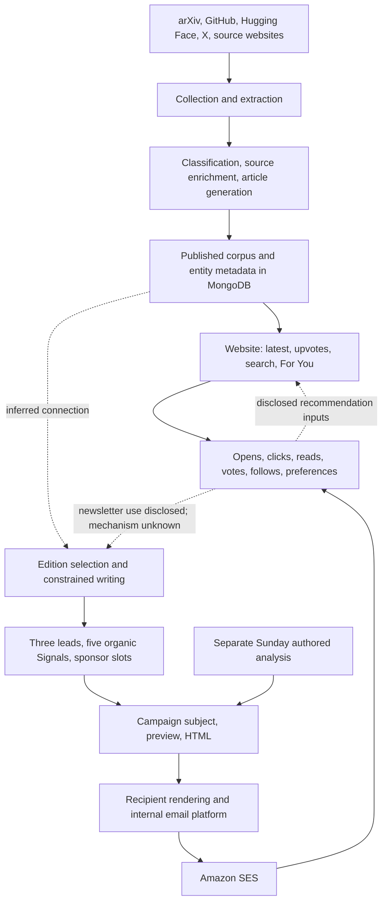

# Reverse engineering AlphaSignal's newsletter system

26 September 2026. This report reconstructs the service that produces and distributes the newsletter, using deployed client code, public APIs, actual editions, original story sources, and AlphaSignal's technical disclosures.

The strongest conclusion is that AlphaSignal operates several connected pipelines. Source discovery and importance scoring produce a published corpus. Website queries sort that corpus. A separate edition workflow chooses stories, writes constrained summaries, fills recurring slots, and creates a campaign. Treating all of that as one ranking algorithm would obscure the parts we can actually recover.

**Observed** means inspected code or measured public output. **Disclosed** means AlphaSignal describes it publicly. **Inferred** means the proposed mechanism explains the evidence but its implementation is private.

## The reconstructed service



The source-to-corpus sequence is disclosed, the query layer is directly observed, and the exact corpus-to-edition connection remains inferred. The diagram does not establish execution order between classification, generation and scoring, or identify queue boundaries.

The [backend engineering role](https://jobs.gusto.com/postings/alpha-signal-llc-backend-engineer-f9f9da28-334f-4637-8c80-5d2504577663) explicitly describes scrapers, LLM enrichment/editorial processing, MongoDB, ranking and knowledge-graph foundations. It lists Python 3.11+, Firecrawl, BeautifulSoup, cron, Sentry, EC2, Atlas/vector search, and Claude/GPT/Gemini APIs. It also names arXiv, GitHub, Hugging Face and X. This establishes the company's stated pipeline and tooling; it does not identify which provider handles each stage or prove every alternative vector database listed is deployed.

A separate [full-stack engineering role](https://jobs.gusto.com/postings/alpha-signal-llc-full-stack-engineer-28c7a0ed-f4eb-4696-92ef-2e3703696189) describes Next.js, an Express REST API, two MongoDB Atlas databases, Node, TypeScript, AWS ECS/Fargate, ECR, ALB, S3, SES, CloudWatch, Secrets Manager and infrastructure/deployment tooling. A reasonable architectural inference is Python content workers alongside a Node application service, sharing persisted content. The division between the two databases is unknown. There is no need to invent a microservice per box in the diagram.

## What was examined

- Twelve actual editions: nine weekday digests between September 15 and 25, and Sunday editions on September 6, 13 and 20.
- The complete 78-item published corpus returned for a three-day window, plus 50 latest records, 50 trending results and controlled filter comparisons.
- Public JavaScript for feed queries, default selection, voting, engagement calls and campaign rendering.
- Seven public article details, four originating repository/model metadata responses, and three detailed source-to-newsletter comparisons.
- Official technical, editorial and email-platform disclosures.

The [evidence directory](./alphasignal-system-evidence/README.md) preserves derived records, request bodies, source URLs, client-code offsets and an offline verification script. These measurements describe one observation period. The public feed reported 6,501 published records and the archive reported 602 editions; neither number measures the full raw ingestion stream. [Archive index](https://api.alphasignal.ai/api/campaign/archive/meta), [documented public service](https://alphasignal.ai/.well-known/agent-skills/alphasignal-news/SKILL.md).

## 1. Collection, normalization and identity

The likely collector has two useful inputs for a story: the artifact itself and the attention around it. A GitHub repository supplies implementation details, licensing and installation instructions. A social announcement supplies discovery context and engagement. The newsletter often links directly to the artifact while displaying a Likes count, even for papers and models. Two matched platform articles also list company X announcements as their first sources. This supports a dual-input design, but does not prove that every story originates from X.

The service already exposes the normalized result of this work. Public article details contain an original URL, multiple supporting source URLs, source titles/site names, a generated headline and subtitle, topic assignments, summary HTML and article content. That is evidence of a source-enrichment stage beyond copying an RSS headline. [Public article example](https://alphasignal.ai/news/typellm-forces-llms-to-return-valid-json-every-time-5-8x-faster), [MCP contract](https://api.alphasignal.ai/mcp/server-card).

The exposed data suggests these domain objects:

| Object | Observed public fields or representation | Implication |
|---|---|---|
| Published item | `_id`, `slug`, `publish_time`, `upvotes`, `content_type`, `regular_categories`, attribution | Common record format across papers, models, repos and news |
| Article detail | `original_url`, `content.html`, `content.markdown`, `summary_html`, `sources`, `sources_info`, `last_updated` | Multiple content representations and explicit provenance |
| Topic membership | Topic plus parent-qualified subtopic | Multi-label classification; a subtopic name alone is not always unique |
| Company/author identity | Username, type, profile, article count | Source attribution and following can be queried independently of topic |
| Campaign | Separate ID, subject, preview, timestamp, HTML | An edition is its own stored output, not merely a feed URL |
| Account state | Topic preferences and engagement fields in client contracts | Inputs exist for personalized retrieval; actual scoring remains private |

These are response models, not recovered collection definitions. Article IDs are 24 hexadecimal characters; campaign IDs are 16. No public campaign-to-article foreign-key list was established. HTML and Markdown availability does not tell us whether both are stored or one is converted on request.

The taxonomy contains **21 topics, 76 parent/subtopic assignments and seven content types**: paper, model, repo, news, tutorial, opinion and deep_dive. Two subtopic names recur under different parents, leaving 74 distinct child labels. The client encodes specific selections such as `AGENTS::MCP`. This is a recoverable classification vocabulary; its existence alone does not prove LLM tagging or embedding-based classification. [Live taxonomy](https://api.alphasignal.ai/api/news/category-tree), [filter adapter](https://alphasignal.ai/_next/static/chunks/4987-5c84b15fec205964.js).

Entity resolution also has limits. The company leaderboard separately lists Anthropic, Claude and ClaudeDevs, and separately lists OpenAI and OpenAI Developers. Its entities appear closer to publishing/social identities than consolidated corporate families. A complete research knowledge graph should not be inferred from these directory records.

## 2. The ranking algorithms we could recover

There are three different ranking questions: admission to the published corpus, ordering within the product, and inclusion in an edition. Only the second is directly reproducible from the public query layer.

### Published-feed ranking

| Test | Measured result |
|---|---|
| Latest, 50 items | All 49 adjacent publication timestamps descend |
| Upvotes, 24 hours | All 15 adjacent counts descend across 16 returned records |
| Upvotes, three days, both pages | All 77 adjacent counts descend across 78 records |
| Trending, 50 items | Exactly the same ordered IDs as the first 50 three-day Upvotes results |
| Three-day eligibility | Article ages range from 14.57 to 71.97 hours at capture |

Within this sample, the public behavior is explained by:

```text
eligible = published records matching filters and publication-time window
latest   = eligible sorted by publish_time descending
upvotes  = eligible sorted by stored upvotes descending
trending = first N of upvotes with a three-day window
```

There is no visible age penalty that reorders unequal counts inside the selected Upvotes window. Time is an eligibility gate in this query behavior. This does not rule out time-dependent updates to the stored count, an upstream learned model, or a different personalized ranker. Tie-breaking was not recovered. [Official MCP interface](https://api.alphasignal.ai/mcp), [saved comparisons](./alphasignal-system-evidence/feed-observations.json).

The homepage also has a concrete fallback rule. When saved or supplied defaults do not take precedence, it probes the last 24 hours with a one-item query. More than 15 matching records selects Upvotes/24h; otherwise it selects Latest. Errors also fall back to Latest. This rule controls the default browsing mode, not newsletter selection. [Deployed homepage code](https://alphasignal.ai/_next/static/chunks/app/%28main%29/page-1705f5a00addf323.js).

There is another small algorithm for sparse feeds. A robotics query for 24 hours returned zero items. With `allow_widening=true`, it returned two and reported a new three-day window. A retrieval-topic query with one result stayed at one with the same flag. This is consistent with recovery from empty results, rather than always filling a page. The client offers the progression 24h, 3d, week, month, all. [Controlled reads](./alphasignal-system-evidence/window-experiments.json), [time controls](https://alphasignal.ai/_next/static/chunks/8737-d7a5956159fa3be3.js).

### What does `upvotes` mean?

The browser displays the server's value directly. A real authenticated vote control exists, with an optimistic increment/decrement of one and rollback on failure. We inspected that code without voting. Therefore onsite voting is part of the service. It does not establish that the initial or total count consists exclusively of unique reader votes. [Vote component](https://alphasignal.ai/_next/static/chunks/4818-7dbf699d43179b49.js).

Comparisons collected within minutes show that the number is not a direct copy of the current originating-platform counter:

| Item | AlphaSignal upvotes | Native source counter | Native downloads |
|---|---:|---:|---:|
| TypeLLM | 2,538 | 735 GitHub stars | Not applicable |
| Rome | 803 | 543 GitHub stars | Not applicable |
| Tiny BERT test model | 3,368 | 4 HF likes | 1,765,841 |
| Parakeet Redux | 1,942 | 157 HF likes | 1,636 |

Sources: [TypeLLM metadata](https://api.github.com/repos/TypeLLM/TypeLLM), [Rome metadata](https://api.github.com/repos/rome-os/rome), [BERT metadata](https://huggingface.co/api/models/sentence-transformers-testing/stsb-bert-tiny-safetensors), [Parakeet metadata](https://huggingface.co/api/models/moondream/parakeet-redux). Corresponding article IDs/URLs and measurements are in [source comparisons](./alphasignal-system-evidence/source-metrics.json) and the feed observations.

Possible explanations include onsite votes, imported social engagement, transformed counters, or combinations of them. Four pairs cannot identify a normalization function. It would be unjustified to fit arbitrary weights and label them AlphaSignal's formula.

Two crosschecks connect editions to the live service. The September 24 biology story showed 36,668 Likes in the archive and 45,658 platform upvotes when inspected later. Claude Code cloud sessions showed 10,171 versus 20,925. Their first sources were [Anthropic's post](https://x.com/anthropicai/status/2102824959827742916) and [ClaudeDevs' post](https://x.com/claudedevs/status/2102871550974427462). Later growth and social-origin counters are plausible, but different capture times prevent proving that explanation. Direct X retrieval was unavailable.

### Upstream importance scoring remains a separate problem

AlphaSignal [describes](https://alphasignal.ai/about) a learned importance function developed from years of production ranking. The public interface returns selected, published records and a count. It does not return rejected candidates, feature vectors, model scores, training labels or explanations. Consequently, the observed count ordering does not establish how they decide which items deserve coverage in the first place.

My most plausible reconstruction is a collector that produces candidates, followed by relevance/quality/novelty assessment and attention-based prioritization. Some of this could be rules, an LLM classifier, a learned scorer, or editorial intervention. An equivalent system could express priority as a function of attention, topic fit, source trust and novelty. Those are proposed inputs, not recovered feature names. Exact weights, training objectives and embedding models remain unknown.

## 3. The newsletter's selection algorithm

The nine weekday editions have an unusually stable output contract:

- Exactly three expanded leads and six Signals.
- Signal position 2 is sponsored in all nine; there are five organic compact items.
- All 27 leads use the label Likes, including GitHub, arXiv and HF destinations.
- The three lead counts strictly descend in every edition.
- The leads have no fixed one-of-each-type quota. Two editions contain three Repo leads.
- Signal positions 3 and 4 point to arXiv in eight of nine issues each. Position 5 points to HF in six of nine.

This supports selection from separate pools or a type-aware slot assignment. Leads can be selected first, then sorted by a common popularity field. Signals need a different allocator. In the four editions where all five organic Signals use the same Likes unit, none is descending. That rules out a simple global descending-Likes pass over the whole issue, without making invalid comparisons between downloads and likes. [Edition measurements and URLs](./alphasignal-system-evidence/edition-observations.json).

A plausible reconstruction is:

```text
candidate pool = recent discoveries and resurfacing items
lead pool      = candidates suitable for an expanded explanation
lead choices   = choose three, then order by common popularity field
signals        = fill compact slots with preferred types and fallbacks
sponsor        = reserved Signal slot 2, plus interleaved larger modules
edition        = introduction + contents + leads + inserts + Signals
```

The choices may be algorithmic, editorial, or mixed. Neither three leads nor descending counts proves they are the top three across the entire upstream corpus. We do not have the historical candidate set at the exact edition cutoff.

There is also a distinct subject-selection step. On September 25, the subject foregrounds Claude Marketplace while the first lead is NVIDIA's speaker model; Marketplace is the second lead. The subject is not mechanically the first ranked headline. Introductions sometimes discuss lower Signals, and one sampled introduction mentions material absent from that edition's selected items. This suggests broader candidate context or separately edited modules. [September 25](https://alphasignal.ai/email/e53c1b581ec9b101), [September 15](https://alphasignal.ai/email/0f2b79151c7087e6).

## 4. Deduplication and freshness have observable limits

LongCat Video Avatar 1.5 appears on September 16 as a Repo lead pointing to GitHub, then on September 17 as a Model lead pointing to HF. Strict product/release-level deduplication across consecutive editions would have removed the second occurrence. Plausible explanations are artifact-level identity, separate source pools, a deliberate repeat override, or an imperfect semantic match. This does not prove that deduplication is absent. [September 16](https://alphasignal.ai/email/b99508ee22518e06), [September 17](https://alphasignal.ai/email/712af216aa4a9b2c).

Freshness also operates at more than one level. A paper submitted June 28 was selected on September 23. The tiny BERT source model was created in November 2023 and last modified in January 2024, while its AlphaSignal article was published on September 25, 2026 and appeared near the top of the 24-hour feed. Thus publication time in the feed is not equivalent to upstream release time. Rediscovery can produce a new article about an old artifact. [Paper history](https://arxiv.org/abs/2606.29540), [model metadata](https://huggingface.co/api/models/sentence-transformers-testing/stsb-bert-tiny-safetensors).

A functional reconstruction should therefore track source creation, source modification, discovery, article publication and edition inclusion separately. The public output does not expose all five timestamps, but conflating them would reproduce misleading novelty claims.

## 5. How the writing layer appears to work

The 27 expanded lead bodies contain **138–178 words, median 158**, excluding titles, labels, metrics and CTAs. Every lead has two to four bullets and three to five paragraphs. The 45 organic Signals contain **9–17 headline words, median 12**. These narrow ranges support constrained generation or a tightly enforced editorial brief. Output shape alone cannot distinguish an LLM prompt from a human following that brief.

The recurring lead pattern is a concrete problem or capability, an explanation of the artifact, a few facts/results, and a practical implication. The transformation is interpretive: it supplies a hook, rearranges source material and adds a reason a developer should care. That is different from merely shortening a source abstract.

Three paired traces show the likely extraction and rewriting stages:

| Source → edition | Transformation observed | What this reveals |
|---|---|---|
| [arXiv study](https://arxiv.org/abs/2606.29540) → [Sep 23](https://alphasignal.ai/email/3b0069ed2fa97e1b) | Retains corpus size, prevalence trend, robustness and individual-paper caution; compresses methods and comparisons | Fact extraction followed by benefit-led rewriting. Different comparison periods become less explicit. |
| [Google AX README](https://github.com/google/ax) → [Sep 22](https://alphasignal.ai/email/3652621d1eb3a9f5) | Turns orchestration mechanics into a compute-efficiency story, feature bullets and installation advice | Technical prerequisites and experimental status receive less attention. The headline suggests rebuilding Kubernetes, although the README requires Kubernetes. |
| [LongCat model card](https://huggingface.co/meituan-longcat/LongCat-Video-Avatar-1.5) and [README](https://github.com/meituan-longcat/LongCat-Video) → [Sep 17](https://alphasignal.ai/email/712af216aa4a9b2c) | Converts animation capabilities and distillation into a cost/accessibility hook and application examples | Deployment constraints and evaluation detail are compressed. The README dates the release to May, despite September novelty framing. |

These comparisons use sources as accessible during this investigation, not immutable snapshots from the sending date. They show risks in the visible output; they do not identify the responsible model or prove a claim had no other supporting source.

A substitute writing contract could request a grounded fact record first, then separately generate a roughly 160-word lead, a roughly 12-word compact headline, and a practical takeaway. Validate quantities, units, dates and caveats before rendering. That is a proposed implementation derived from the output, not an extracted proprietary prompt.

The Sunday workflow differs. Three sampled Sundays contain one attributed analysis article, with article blocks of approximately 1,014, 1,312 and 1,018 words, multiple subheadings and no three-lead/six-Signal structure. Ben Dickson is named; September 20 includes material attributed to a conversation with AlphaSignal. [Sep 6](https://alphasignal.ai/email/16eeb59411f865b1), [Sep 13](https://alphasignal.ai/email/dbce367ad97e73c6), [Sep 20](https://alphasignal.ai/email/8f2be5a907777e51).

The [About page](https://alphasignal.ai/about) claims an autonomous editorial system without humans in the loop. The [editorial standards](https://alphasignal.ai/editorial-team) assign final decisions to an editor and describe proofreading. The evidence supports multiple publishing paths or inconsistent scope in those claims. It does not support declaring every newsletter fully autonomous.

## 6. Campaign assembly, delivery and feedback

Weekday markup repeats an introduction, optional author/webinar block, contents, three lead records, two interleaved partner modules, and Signals. The contents repeats the same lead headlines in the same order. A shared structured edition record is a strong explanation for that consistency, although a controlled editor could produce the same result.

Campaign metadata is independently queryable. September contains 19 weekday records and three Sunday records through the 25th. Eighteen weekday timestamps cluster around 04:07–04:14 UTC; September 1 is an exception. Sunday timestamps are more variable. That is consistent with scheduled weekday production and a different Sunday workflow. The timestamps are not verified inbox delivery times. [September campaign records](https://api.alphasignal.ai/api/campaign/archive?year=2026&month=9).

The archive is a transformed copy. The [reader code](https://alphasignal.ai/_next/static/chunks/app/%28main%29/email/%5Bnews_id%5D/page-46d5d1aad6793542.js) removes feedback and footer regions, rewrites images, injects styles/base URLs and handles attribution links. Therefore public HTML cannot establish exactly what subscribers received. Missing unsubscribe controls or pixels in an archive are not evidence of missing controls in delivered email. Unresolved first-name merge fields are template evidence, not proof of a sending defect.

AlphaSignal's [privacy disclosure](https://alphasignal.ai/privacy) identifies an internal email platform built on Amazon SES, wrapped links, tracking pixels, and engagement-based recommendations. It names topics of interest, opens, clicks and their timing/frequency as available recommendation information. That supports recipient rendering, sending and feedback collection as separate service responsibilities. It does not reveal queue implementation, batching limits, SES configuration, bounce handling, retry rules or per-recipient content variants.

For website recommendations, client code invokes the same feed with `sort="for-you"`, with a default week window. Profile fields include topic/content preferences and professional context. Separate authenticated calls record article clicks and reads; voting, bookmarking and following are separate actions. These are recoverable inputs and interfaces. We did not access personalized accounts, so the actual recommender remains untested. [Engagement/profile client](https://alphasignal.ai/_next/static/chunks/4436-da9870871fb5268f.js).

A topic-filtered recommender would fit the public contract. A vector or learned recommender would also fit. The job listing's vector-search references do not distinguish them. Likewise, engagement collection does not prove that click outcomes train the importance model rather than supporting analytics or simpler personalization.

## 7. Public interfaces and implementation boundaries

The REST API base in shipped client configuration is `https://api.alphasignal.ai/api`.

| Interface | Recoverable contract |
|---|---|
| `POST /news` | Read query with pagination, topics/subtopics, companies/authors, content types, dates, sort, exclusions, IDs and widening |
| `GET /news/search/list` | Search with query, pagination, order and optional time/type filters |
| `GET /news/category-tree` | Explicit topic/subtopic vocabulary |
| `POST /news/categories`, `/news/content-types` | Filtered facet contracts visible in client code |
| `GET /campaign/archive/meta` | Archive month index and counts |
| `GET /campaign/archive?year=…&month=…` | Campaign IDs, subjects, previews and timestamps |
| `https://api.alphasignal.ai/mcp` | Documented anonymous discovery and OAuth-protected personalized/full-content reads |

Sources: [application config](https://alphasignal.ai/_next/static/chunks/main-app-209c9859b0843e63.js), [feed client](https://alphasignal.ai/_next/static/chunks/4987-5c84b15fec205964.js), [archive client](https://alphasignal.ai/_next/static/chunks/app/%28main%29/archive/page-94361c973a8879e3.js), [MCP server card](https://api.alphasignal.ai/mcp/server-card). Some contracts were inspected without invoking them; the evidence files distinguish measured calls.

MCP exposes list/search/article, trending, topic/type, company and author discovery, alongside protected For You/bookmark/follow/full-article tools. Search describes matching all terms against titles and bodies, followed by Latest or Upvotes sorting. A one-term query matched; adding an unrelated second term produced zero. That supports the documented conjunction behavior, but does not recover tokenization, stemming or indexes.

The implementation and documentation disagree in a few places. Latest respected a relative 24-hour window but ignored an explicit custom date range in our tests. The MCP description says Latest ignores both. Three-day and 24-hour company leaderboards returned empty while the all-time endpoint returned 149 rows. These are limits on what we could validate, not evidence of a recovered aggregation formula.

## What can be rebuilt faithfully

The observed feed ordering, query filters, sparse-feed recovery, topic vocabulary, edition slot structure, writing-length constraints and campaign representation can all be reproduced. The following would be a defensible implementation plan for an equivalent service:

1. Collect primary artifacts and discovery/attention records separately, preserving counter units and provenance.
2. Normalize URLs and extract facts. Track artifact identity and product/release identity separately.
3. Classify by the public topic/type vocabulary; attach source documents and entity links.
4. Maintain a distinct candidate priority score. Keep reader votes, native counters and model relevance separate instead of assuming they are interchangeable.
5. Publish article records; implement Latest and Upvotes as measured query modes.
6. Select three leads and five compact items using separate slot rules. Reserve sponsor positions explicitly.
7. Generate constrained copy, then validate dates, numbers, source support and repeat-release identity.
8. Generate the introduction, contents, subject and preview against the final edition. The subject may foreground a story other than lead one.
9. Freeze a campaign version, render recipient fields, send through an email platform, and collect engagement against article/campaign/link identities.

Steps involving candidate scoring, semantic deduplication, validation, or recommendation algorithms are design proposals. They should not be mistaken for recovered AlphaSignal internals. In particular, stronger release-identity and novelty checks would improve on the failure cases observed here.

The private parts still missing are the complete collector roster/cadence, discarded candidates, importance-model features and weights, score provenance, exact prompts/providers, deduplication thresholds, editorial approval gates, personalized ranking, and delivery operations. Recovering those from output would require more than published winners: controlled candidate comparisons, aligned historical engagement snapshots, multiple recipient variants, or internal documentation. The present evidence gives a concrete service reconstruction and several exact algorithms, while preserving that boundary.
